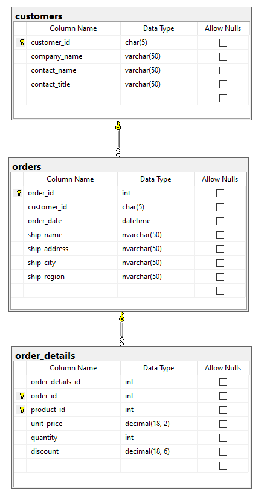

# SSUpsert

The SSUpsert Python script allows you to perform an upsert of data in a Python pandas dataframe into an existing SQL Server database table.

While SSUpsert has been used for a while it should be considered alpha preview until all of the bugs are discovered / fixed and features are added.  Reach out to Jack with any comments, suggestions, or ideas - joimburg@syr.edu.

# Getting started - create the sample database

The SQL script to build the database used in these examples is <a href="northwind.sql">here</a> - this has some data from the Northwind database.



# A few things for starters...
* The dataframe must have all of the columns from the database table
* The field names are case sensitive
* The data types should match as close as possible
* Null values should be None in the dataframe
* Keys in the dataframe must be unique or it will fail; auto-increment numbers should be 0 for new rows / records
* All of the normal database rules apply- referential integrity, you can't put null into a non-nullable column, etc.


# Update and insert Customers

The primary key for **customers** is **customer_id**.

```python
from ssupsert import upsert
import pyodbc
import pandas as pd


# read the customers data into the dataframe
connection_str = "DRIVER={ODBC Driver 13 for SQL Server}; SERVER=localhost\\SQLEXPRESS; DATABASE=Upsert_test1; Trusted_Connection=yes"
conn = pyodbc.connect(connection_str) 
customers_frame = pd.read_sql("select * from customers", conn)
conn.close()

# Update all of the company names - append an x
customers_frame["company_name"] = customers_frame["company_name"] + 'X'

# add a new row to the dataframe
dict = {
    "customer_id": "ACMET", 
    "company_name": "ACME Tools", 
    "contact_name": "Joe Jones", 
    "contact_title": "Engineer"
}
customers_frame = customers_frame.append(dict, ignore_index = True)

# upsert the values
upsert(customers_frame, "customers", "dbo", connection_str)
```

# Update and insert Orders

The primary key for **orders** is **order_id** - this is an auto-incremented number.  Use 0 for **order_id** when creating a new row in the dataframe.

```python
# Get all of the Orders
conn = pyodbc.connect(connection_str) 
orders_frame = pd.read_sql("select * from orders", conn)
conn.close()

# Update ship_city Helsinki to HELSINKI
orders_frame.loc[orders_frame["ship_city"] == "Helsinki", "ship_city"] = "HELSINKI"

# create a new order
dict = {
    "order_id": 0, 
    "customer_id": "WILMK", 
    "order_date": "2022-04-16", 
    "ship_name": "Mary Smith",
    "ship_address": "305 Main Street", 
    "ship_city": "New York", 
    "ship_region": "NY"
}
orders_frame = orders_frame.append(dict, ignore_index = True)

# upsert the values
upsert(orders_frame, "orders", "dbo", connection_str)
```

# Update and insert Order Details

The primary key for **order_details** is *(order_id, product_id)*.  There is also an auto-increment field.  Use 0 when creating a new row in the frame.

```python
# Get all of the order details
conn = pyodbc.connect(connection_str) 
orders_frame = pd.read_sql("select * from order_details", conn)
conn.close()

# Update all of the last names - append an x
orders_frame.loc[orders_frame["product_id"] == 21, "unit_price"] = 11.99

# add a new row to the dataframe
dict = {
    "order_details_id": 0,
    "order_id": 10856, 
    "product_id": 99, 
    "unit_price": 4.25, 
    "quantity": 25, 
    "discount": 0
}
orders_frame = orders_frame.append(dict, ignore_index = True)

# upsert the values
upsert(orders_frame, "order_details", "dbo", connection_str)
```
